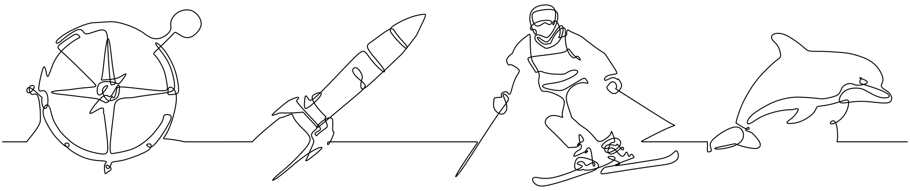

# Single-Line Drawing Generation via Semantics-Driven Optimization 

[Tanguy Magne](https://tanguymagne.com/), [Alexandre Binninger](https://alexandrebinninger.com), [Ruben Wiersma](https://rubenwiersma.nl), [Olga Sorkine-Hornung](https://igl.ethz.ch) <br />

<a href="https://igl.ethz.ch/projects/sldgen/"></a>
    <a href="https://igl.ethz.ch/projects/sldgen/single-line-drawing-generation-computer-graphics-forum-2026-magne-et-al.pdf" alt ="paper"> </a>
    <a href="https://doi.org/10.1111/cgf.70502" alt="doi">
    </a>



This repository contains the code for the CGF paper **"Single-Line Drawing Generation via Semantics-Driven Optimization"**.

The code is partially based on the [ControlSketch](https://github.com/swiftsketch/SwiftSketch) part of SwiftSketch. We thank the authors for sharing their work.

## 🐋 Docker

A prebuilt Docker image is available on Docker Hub so you can reproduce the results without going through the installation steps below. See the [`tanguymagne/sldgen`](https://hub.docker.com/r/tanguymagne/sldgen) repository on Docker Hub for prerequisites, the run command, and how to mount your data and Hugging Face cache.

## 🛠️ Installation

**1. Create and set up a new conda environment**
```bash
conda create -n sldgen python=3.9.19 -y
conda activate sldgen
conda install cuda -c nvidia/label/cuda-12.4.0
pip install "setuptools<78" wheel
```

**2. Install diffvg**

This is the differentiable rasterizer used to optimize the curve parameters. The following instructions are taken from their [installation guide](https://github.com/BachiLi/diffvg#install).

```bash
git clone git@github.com:BachiLi/diffvg.git
cd diffvg
git submodule update --init --recursive
conda install -y pytorch torchvision -c pytorch
conda install -y numpy
conda install -y scikit-image
conda install -c conda-forge cmake=3.28
conda install -y -c conda-forge ffmpeg
pip install svgwrite
pip install svgpathtools
pip install cssutils
pip install numba
pip install visdom --no-build-isolation
pip install torch-tools
python setup.py install
```

**3. Install the repulsion loss**

The repulsion loss uses [the implementation](https://github.com/kenji-tojo/fab3dwire) from the Fabricable 3D Wire Art paper. To install:
```bash
git clone git@github.com:kenji-tojo/fab3dwire.git
cd fab3dwire && cd wiregrad
conda install conda-forge::eigen
pip3 install --no-build-isolation git+https://github.com/openai/CLIP.git@a1d071733d7111c9c014f024669f959182114e33
pip3 install -r ./requirements.txt
pip3 install .
```

**4. Install the TSP solver**

We use the Concorde TSP solver to initialize the curve before optimization. Full installation instructions are available [here](https://www.math.uwaterloo.ca/tsp/concorde/DOC/README.html).

In short, first download the source code for version 03.12.19 from [here](https://www.math.uwaterloo.ca/tsp/concorde/downloads/downloads.htm), then extract it:
```
wget https://www.math.uwaterloo.ca/tsp/concorde/downloads/codes/src/co031219.tgz
gunzip co031219.tgz
tar xvf co031219.tar
cd concorde
```

Download `qsopt.a` and `qsopt.h` from [here](https://www.math.uwaterloo.ca/~bico/qsopt/downloads/downloads.htm), and place them in the same folder (note that the following links are for Ubuntu):
```
wget https://www.math.uwaterloo.ca/~bico/qsopt/downloads/codes/ubuntu/qsopt.a
wget https://www.math.uwaterloo.ca/~bico/qsopt/downloads/codes/ubuntu/qsopt.h
```

Then run:
```bash
./configure --with-qsopt=/full/path/to/concorde/folder --enable-ccdefaults
make
```
It is important to supply the full path to the Concorde folder. Relative paths or paths that use `~` will not work.

This should create a `TSP` folder containing a concorde binary. Create an environment variable `CONCORDE_PATH` pointing to this binary:
```bash
export CONCORDE_PATH='[path to concorde]/TSP/concorde'
```

**5. Install other dependencies**
```bash
pip install torch==2.3.1 torchvision==0.18.1 torchaudio==2.3.1 --index-url https://download.pytorch.org/whl/cu121
pip install -r requirements.txt
```

**6. Authenticate with Hugging Face**

[Follow these instructions](https://huggingface.co/docs/huggingface_hub/guides/cli#hf-auth-login) to create a Hugging Face user access token and authenticate.

Then [request access to Stable Diffusion 3.5 medium](https://huggingface.co/stabilityai/stable-diffusion-3.5-medium) using the same account.


## ▶️ Running

Running the code requires a machine with a GPU with at least 24GB of VRAM (tested on an RTX 4090).

To run the code and generate a single-line drawing of a given image, simply run:
```bash
python sldgen.py --target ./data/firefighter.png
```
This command uses default parameters that often give the best results. However, many parameters can be tuned. For more info, check the [docs](https://github.com/tanguymagne/SLDgen/blob/main/docs.md) or run:
```bash
python sldgen.py --help
```

## 🪪 Citation

```
@article{Magne:SLDgen:2026,
    title   = {Single Line Drawing Generation via Semantics-Driven Optimization},
    author  = {Magne, Tanguy and Binninger, Alexandre and Wiersma, Ruben and Sorkine-Hornung, Olga},
    journal = {Computer Graphics Forum},
    volume  = {n/a},
    number  = {n/a},
    pages   = {e70502},
    year    = {2026},
    doi     = {https://doi.org/10.1111/cgf.70502},
}
```